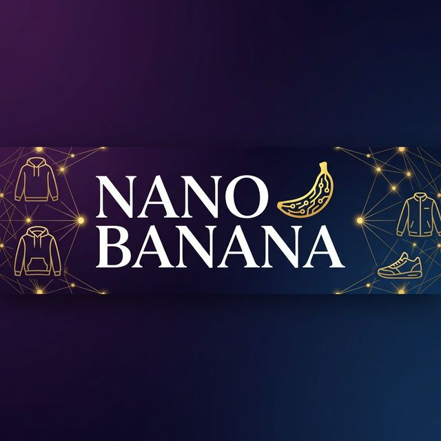

<p align="center">
  
</p>

<h1 align="center">🍌 Nano Banana</h1>

<p align="center">
  <b>AI-Powered Multimodal Fashion Search Assistant</b>
</p>

<p align="center">
  
  
  
  
  
</p>

<p align="center">
  Search fashion products using <b>text</b>, <b>images</b>, or <b>both</b> — powered by semantic vector search and conversational AI.
</p>

---

## ✨ Features

| Feature | Description |
|---------|-------------|
| 🔍 **Semantic Search** | Find products by meaning, not just keywords — powered by SigLIP embeddings |
| 🖼️ **Image Search** | Upload a photo and find visually similar products instantly |
| 🧠 **AI Chat Assistant** | Conversational interface with intent detection (chat vs. search) |
| 🌐 **Bilingual Support** | Seamless Arabic ↔ English — queries are auto-translated for optimal search |
| 💰 **Smart Filtering** | Price range filters extracted automatically from natural language |
| 🗃️ **Product Grouping** | Results merge image + text data per product for rich, complete cards |
| ⚡ **Real-time UI** | Modern chat interface with image upload, suggestion chips, and smooth UX |

---

## 🏗️ Architecture

```
┌─────────────────────────────────────────────────────────┐
│                    Chat UI (Browser)                    │
│            HTML / CSS / JS  •  Jinja2 Templates         │
└──────────────────────┬──────────────────────────────────┘
                       │  HTTP (REST)
                       ▼
┌──────────────────────────────────────────────────────────┐
│                   FastAPI Backend                        │
│                                                          │
│  ┌──────────┐  ┌──────────────┐  ┌───────────────────┐  │
│  │ Intent   │  │ Param        │  │ Response           │  │
│  │ Classify │──│ Extraction   │──│ Generation         │  │
│  │ (Gemini) │  │ (Gemini)     │  │ (Gemini)           │  │
│  └──────────┘  └──────┬───────┘  └───────────────────┘  │
│                       │                                  │
│  ┌────────────────────▼──────────────────────────────┐  │
│  │        Semantic Search Engine                      │  │
│  │  SigLIP Embeddings  +  Qdrant Vector DB            │  │
│  │  (Text & Image vectors in shared latent space)     │  │
│  └────────────────────────────────────────────────────┘  │
└──────────────────────────────────────────────────────────┘
```

### How It Works

1. **User sends a query** — text, image, or both
2. **Intent Classification** — Gemini determines if the user wants to *search* or *chat*
3. **Parameter Extraction** — Gemini extracts keywords, category, color, fit, and price constraints from the query (Arabic is translated to English for embedding)
4. **Embedding Generation** — SigLIP generates a vector for the query (text or image)
5. **Vector Search** — Qdrant finds the most similar products using cosine similarity + metadata filters
6. **Product Grouping** — Results are grouped by product folder, merging image and text data
7. **Natural Response** — Gemini generates a friendly, human-like response presenting the results

---

## 📁 Project Structure

```
nano-banana/
├── src/
│   ├── api.py                 # FastAPI application & endpoints
│   ├── main.py                # CLI interface for search
│   ├── config.py              # Environment config (API keys, DB settings)
│   ├── llm_utils.py           # Gemini LLM integrations (intent, extraction, response)
│   ├── model_utils.py         # SigLIP model loading & embedding generation
│   ├── search_utils.py        # Qdrant vector search with filtering & grouping
│   ├── product_ingestion.py   # Batch product data ingestion pipeline
│   ├── system_prompt.txt      # AI assistant persona & behavior rules
│   ├── static/
│   │   ├── css/style.css      # UI styles
│   │   └── js/main.js         # Frontend logic
│   └── templates/
│       └── index.html         # Chat UI template
├── tests/
│   └── test_search_flow.py    # End-to-end search flow tests
├── uploads/                   # Temporary uploaded image storage
├── qdrant_local/              # Local Qdrant storage (fallback)
├── .env                       # Environment variables
└── README.md
```

---

## 🚀 Getting Started

### Prerequisites

- **Python 3.10+**
- **Qdrant** — vector database ([install guide](https://qdrant.tech/documentation/quick-start/))
- **Google Gemini API Key** — for LLM capabilities
- **CUDA (optional)** — for GPU-accelerated embeddings

### 1. Clone the Repository

```bash
git clone https://github.com/kirollos2001/Multimodal_Rag.git
cd Multimodal_Rag
```

### 2. Create Virtual Environment

```bash
python -m venv venv

# Windows
venv\Scripts\activate

# macOS/Linux
source venv/bin/activate
```

### 3. Install Dependencies

```bash
pip install fastapi uvicorn python-multipart jinja2
pip install google-generativeai
pip install torch transformers pillow
pip install qdrant-client
pip install python-dotenv
pip install sentencepiece protobuf
```

### 4. Configure Environment Variables

Create a `.env` file in the project root:

```env
# Gemini API
GEMINI_API_KEY=your_gemini_api_key_here
GEMINI_MODEL_NAME=gemini-3-flash-preview

# Qdrant
QDRANT_HOST=localhost
QDRANT_PORT=6333
QDRANT_COLLECTION_NAME=products_siglip

# SigLIP Model
SIGLIP_MODEL_NAME=google/siglip-base-patch16-224

# Search
SEARCH_THRESHOLD=0.3
```

### 5. Start Qdrant

```bash
docker run -p 6333:6333 qdrant/qdrant
```

> **Note:** If Qdrant is not running, the system automatically falls back to local storage (`./qdrant_local`).

### 6. Ingest Product Data

Organize your product images in folders, each with an `info.txt`:

```
products_images/
├── product_001/
│   ├── info.txt         # Description: ..., ID: ..., Price: ...
│   ├── front.jpg
│   └── side.jpg
├── product_002/
│   ├── info.txt
│   └── main.png
└── ...
```

**`info.txt` format:**
```
Description: Black oversized hoodie with front pocket
ID: PROD-001
Price: 850
```

Run the ingestion pipeline:
```bash
python -m src.product_ingestion
```

### 7. Launch the App

```bash
uvicorn src.api:app --reload --host 0.0.0.0 --port 8000
```

Open your browser at **[http://localhost:8000](http://localhost:8000)** 🎉

---

## 📡 API Reference

### `GET /`
Serves the main chat UI.

### `POST /chat`
Main conversational endpoint — handles both chat and search.

| Parameter | Type | Description |
|-----------|------|-------------|
| `message` | `string` (form) | User's text message |
| `image_file` | `file` (form) | Optional image upload |
| `conversation_history` | `string` (form, JSON) | Optional chat history for context |

**Response:**
```json
{
  "reply": "لقيتلك جاكت أسود حلو من Folder_X بسعر 1200 جنيه 🔥",
  "intent": "search",
  "products": [
    {
      "id": "PROD-001",
      "folder": "black_jacket_01",
      "price": 1200.0,
      "score": 0.8742,
      "description": "Black oversized jacket",
      "image": "front.jpg"
    }
  ],
  "extracted_params": {
    "keywords": "black jacket",
    "category": "jacket",
    "color": "black",
    "shape": null,
    "price_min": null,
    "price_max": 2000.0
  }
}
```

### `POST /search` *(legacy)*
Direct search endpoint without conversational AI.

| Parameter | Type | Description |
|-----------|------|-------------|
| `text_query` | `string` (form) | Search text |
| `image_file` | `file` (form) | Optional image upload |

---

## 🧪 Testing

Run the end-to-end search flow test:

```bash
python tests/test_search_flow.py
```

This tests the full pipeline:
1. ✅ Qdrant connectivity
2. ✅ SigLIP embedding generation
3. ✅ Semantic search with price filtering
4. ✅ LLM parameter extraction
5. ✅ LLM natural language response generation

---

## 🛠️ Tech Stack

| Component | Technology |
|-----------|-----------|
| **Backend** | [FastAPI](https://fastapi.tiangolo.com/) |
| **LLM** | [Google Gemini](https://ai.google.dev/) (intent classification, param extraction, response generation) |
| **Embeddings** | [SigLIP](https://huggingface.co/google/siglip-base-patch16-224) (unified text-image encoder) |
| **Vector DB** | [Qdrant](https://qdrant.tech/) (cosine similarity search + metadata filtering) |
| **Frontend** | HTML, CSS, JavaScript + Jinja2 templates |
| **Deep Learning** | [PyTorch](https://pytorch.org/) + [HuggingFace Transformers](https://huggingface.co/docs/transformers) |

---

## 🔑 Key Design Decisions

- **SigLIP over CLIP** — SigLIP provides a shared embedding space for both text and images in a single model, enabling cross-modal search with a single vector collection.
- **Gemini for NLU** — Using Gemini for intent classification, parameter extraction, and response generation keeps the system flexible and multilingual without additional NLP pipelines.
- **Product Grouping** — Each product can have multiple vectors (text description + multiple images). Search results are grouped by product folder and merged to provide a complete result with all available metadata.
- **Arabic-First Support** — The system prompt and UI are designed for Arabic-speaking users, with automatic translation to English keywords for semantic embedding alignment.

---

## 📄 License

This project is for educational and personal use.

---

<p align="center">
  Made with ❤️ and 🍌
</p>
